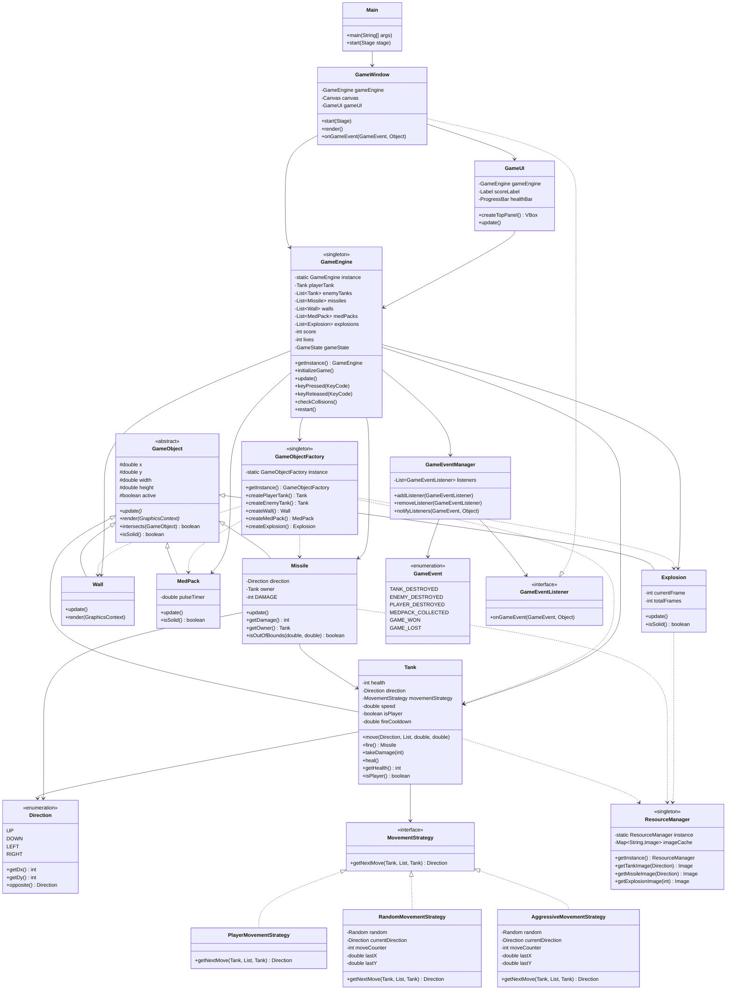

# Tank War Game - UML Class Diagram

## Simple Class Diagram in Mermaid.js

---

## Design Patterns Summary

### 1. **Singleton Pattern**
- `GameEngine` - Single game instance
- `GameObjectFactory` - Single factory instance
- `ResourceManager` - Single resource loader

### 2. **Factory Pattern**
- `GameObjectFactory` - Creates all game objects

### 3. **Strategy Pattern**
- `MovementStrategy` - Different tank behaviors
- `PlayerMovementStrategy` - Keyboard control
- `RandomMovementStrategy` - Random AI
- `AggressiveMovementStrategy` - Chase player AI

### 4. **Observer Pattern**
- `GameEventManager` - Event publisher
- `GameEventListener` - Event subscriber interface
- `GameWindow` - Event subscriber implementation

---

## Key Relationships

### Inheritance (is-a)
- Tank **is-a** GameObject
- Missile **is-a** GameObject
- Wall **is-a** GameObject
- MedPack **is-a** GameObject
- Explosion **is-a** GameObject

### Composition (has-a)
- Tank **has-a** MovementStrategy
- Tank **has-a** Direction
- Missile **has-a** Direction
- GameEngine **has-a** List of Tanks, Missiles, Walls, etc.

### Implementation (implements)
- PlayerMovementStrategy **implements** MovementStrategy
- RandomMovementStrategy **implements** MovementStrategy
- AggressiveMovementStrategy **implements** MovementStrategy
- GameWindow **implements** GameEventListener

### Dependency (uses)
- Factory **creates** game objects
- ResourceManager **provides** images to renderable objects
- GameEngine **uses** Factory to create objects

---

**This diagram shows all major classes and their relationships in a clean, simple format!**

